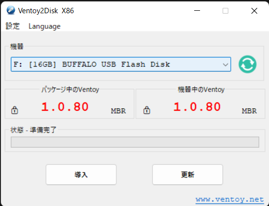
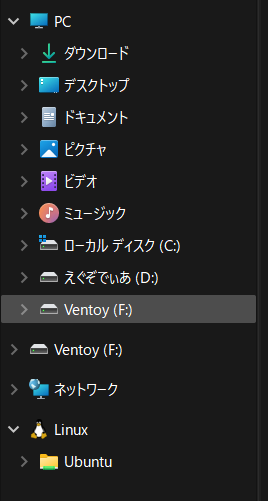

+++
title =  "Ventoy"
date = "2022-10-13T16:08:02+09:00"
image = "Ventory_image.png"
description = "複数のISOファイルを一つのUSBにまとめて起動時に選択ができるTOOL"
categories = [
	"tools",
	"技術系",
]
tags = [
	"tools",
]
draft = false
+++

私はLinuxをインストールするときにUSBをフォーマットしてから新しくISOを焼き直す。
また違うディストリビューションをインストールしたくなったら書き直す。
これを繰り返していました。GRUBでbootを選択できますし、理論上は可能なんだろうなとは
ぼんやり考えていましたが、結構前にツイッターで知ったので試してみました。

## ダウンロードする

https://www.ventoy.net/en/download.html  
WindowsとLinuxに対応しています。LinuxはCLIでもできるみたいです。

## インストールする

私はWindows環境で行いました。ダウンロードしたZipファイルを解凍して、Ventoy2Disk.exeを実行します。

"導入"で選択したＵＳＢにVentoyをインストールします。  
"パッケージ中のVentoy"はリリースされている最新のVentoyのバージョン  
"機器中のVentoy"は選択した機器にインストールされているVentoyのバージョン  

## Ventoyで起動させたいファイルを入れていく
インストールが完了したらファイルマネージャーからVentoyというボリュームが現れます。  
  
Ventoyの中は空になっていると思います。そこに起動させたいISOファイルなんかをぶっこんでいきます。
UEFIでVentoyを選択して起動したら成功です。お疲れさまでした。
