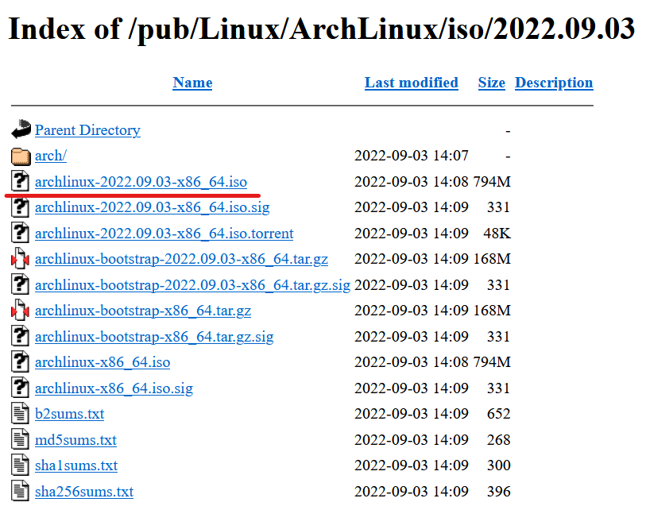

+++
title = "Arch Linuxのインストール"
description = "Arch Linuxのインストールガイド"
date = 2022-09-10T01:27:17+09:00
draft = true
image = "https://archlinux.org/static/logos/archlinux-logo-light-scalable.1ae4cc2e2469.svg"
tags = [
	"linux",
	"arch",
	"privacy",
  "未完成",
	]
Categories = [
	"linux",
]
+++

## イントロダクション
Linuxでしばらく遊んでいるとArch Linuxに出会うと思います。  

Arch Linuxはシンプル、ミニマリズムに焦点を当てたLinuxディストリビューションです。
インストールはCUI操作であり、コマンドを覚えたての初心者からするととっつきにくい
ディストリビューションです。  
しかしインストールをしてみるだけで、普段パソコンの電源ボタンを押してから
OSのロック画面を開くまでの間に何が行われているか感覚的に掴むことができます。
Linuxをもっと知りたい初心者向けに書いていきますので是非とも挑戦してください。

## Arch Linuxについて

Arch Linuxの特徴としてローリングリリースを採用しています。
ローリングリリースとはパッケージを頻繫に更新することで常に
最新のパッケージを利用し続けるということです。
そのためOSのバージョンという概念がありません。

## インストールする。

### USBにArchインストールメディアをインストールしていきます。  

ここはほかのディストリビューションとあまり変わりません。

[Arch Linuxをダウンロード](https://www.archlinux.jp/download/ "")  

好みの日本サーバーを選択してイメージファイルをダウンロードしてください。

インストールが完了したら、1GB以上のUSBをパソコンに差し込んでRufus又はEtcherでイメージファイルを
焼いていきます。

## 続きはいつか書きます。
