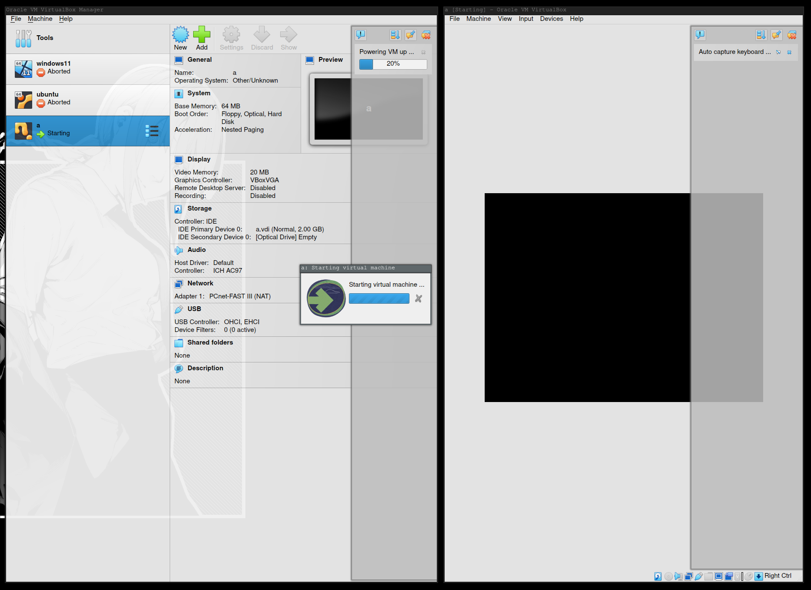

ArchlinuxにVirtualboxをいれようと思ったら起動しなかったので備忘録です。

## 症状

起動させると20%で止まってゾンビプロセスとなってしまいます。



### 対処方法

ブートローダー起動時にオプションで```ibt=off```と記述する

#### Systemd-bootで永続化させる
ファイルを開いてください  
```sudo vim /boot/loader/entries/hogehoge.conf```  
hogehogeにはもともとある設定ファイルに名前を置き換えてください  

optionsにある項目の末尾に```ibt=off```と記述してください。  

こんな感じ  
```diff
title Arch Linux (linux)
linux /vmlinuz-linux
initrd /intel-ucode.img
initrd /initramfs-linux.img
- options root=PARTUUID <なんか書かれてるかもしれない部分> rootfstype=ext4 
+ options root=PARTUUID <なんか書かれてるかもしれない部分> rootfstype=ext4 ibt=off
```

### ibtってなに
Intel 11世代から導入されたCPUの保護機能みたいです  

<font color="DarkSalmon ">[参考]</font>  
https://gihyo.jp/article/2022/11/daily-linux-221107  
https://github.com/nns779/px4_drv/issues/24

Linux kernel 5.18からIBTはサポートしていたみたいですが、6.02でデフォルトで機能するみたいです。
Arch linux kernel は5.18からデフォルトになっていたってこと？？　

別問題ですが、intel 11thにはCPUのバグで起動するとフリーズするたいです  
同じような症状を持った方がいらっしゃったので気になりました。

<font color="DarkSalmon ">[参考]</font>  
https://sakura-education.com/myblog/archives/1282  


### 参考にした記事　

[ArchLinuxのインストールに失敗した](https://zenn.dev/warspitenavy/articles/e7ab5734604639)  
[カーネルパラメータ](https://wiki.archlinux.jp/index.php/%E3%82%AB%E3%83%BC%E3%83%8D%E3%83%AB%E3%83%91%E3%83%A9%E3%83%A1%E3%83%BC%E3%82%BF)  
[Virtualboxが起動しない（kernel 5.18／kernel 5.19） – 日々の記録簿](https://sakura-education.com/myblog/archives/1282)  