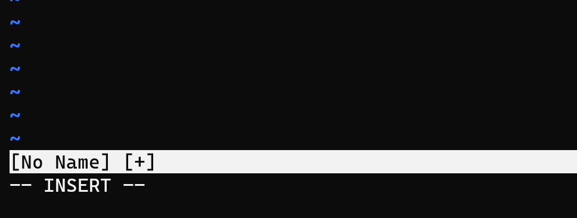

## イントロ

自分はTails Linuxを触ってるときにVimを初めて触りました。最初は
***終了もできません***
が触っているうちに慣れてきてキーバインドが癖になり、ないと生きていけなくなります。

---

## 起動方法
	vim
これで起動できます。

	vim [ファイル名]
これで名前のついたファイルを編集できます。

---


## 移動方法
移動には
**[h,j,k,l]**
を使います。

			[上に移動]
				k
	[右に移動] h       l  [左に移動]
				j
			[下に移動]	

最初は慣れないかもしれませんが、キーがホームポジションに近いように設定されています。
そのため慣れるととても扱いやすくなります。


---

## 基本操作
操作の基本的はコロンを入力してコマンドを入力します。

### 終了
    :q
保存せずにvimを終了させます。  


### 保存
    :w
編集中のファイルを保存します。

### 保存して終了
	:wq
保存してからvimを終了します。

### 保存しないで終了
	:q!
保存しないでvimを終了します。


---

## インサートモード


インサートモードは文字を入力しますよー、というモードです。
コマンドを入力すると画像のように右下にINSERTと表示されます。

	i
iを押すと選択中の前の文字にカーソルが当てられて文字を挿入できるようになります。

	a
aを押すと選択中の後の文字にカーソルが当てられて文字を挿入できるようになります。

#### インサートモードをぬける
インサートモードを抜けるときはキーボード左上のESCキーを押します。  
右下に表示されていたINSERTの文字が消えていたら抜けられています。


---


## 行番号を表示する
	:set number
省略することもできます。

	:set nu
これでも同じ結果になります。


---


## Vimの設定ファイル
`:set nu`などは一度vimを抜けてから起動すると元に戻ってしまいます。そのためvimの設定ファイル
に予め記述する必要があります。  
Vimを設定するためのファイルは`~/.vimrc`にあります。もしもなかったらファイルを作成しましょう。

作成が出来たら`vim  ~/.vimrc`で編集しましょう。

書き方はコマンドで打っていることをそのまま書けばいいだけです。
```php
set number
```

---

## Vimmer

以上のことが出来ればファイルをちょこっとだけ編集する分には問題ないと思います。
この先はVIMをもっと極めたい人向けです。

### vimtutor

Vimに入っているチュートリアルです。日本語化もできたはずです。


## vi Vim NeoVim GVim
