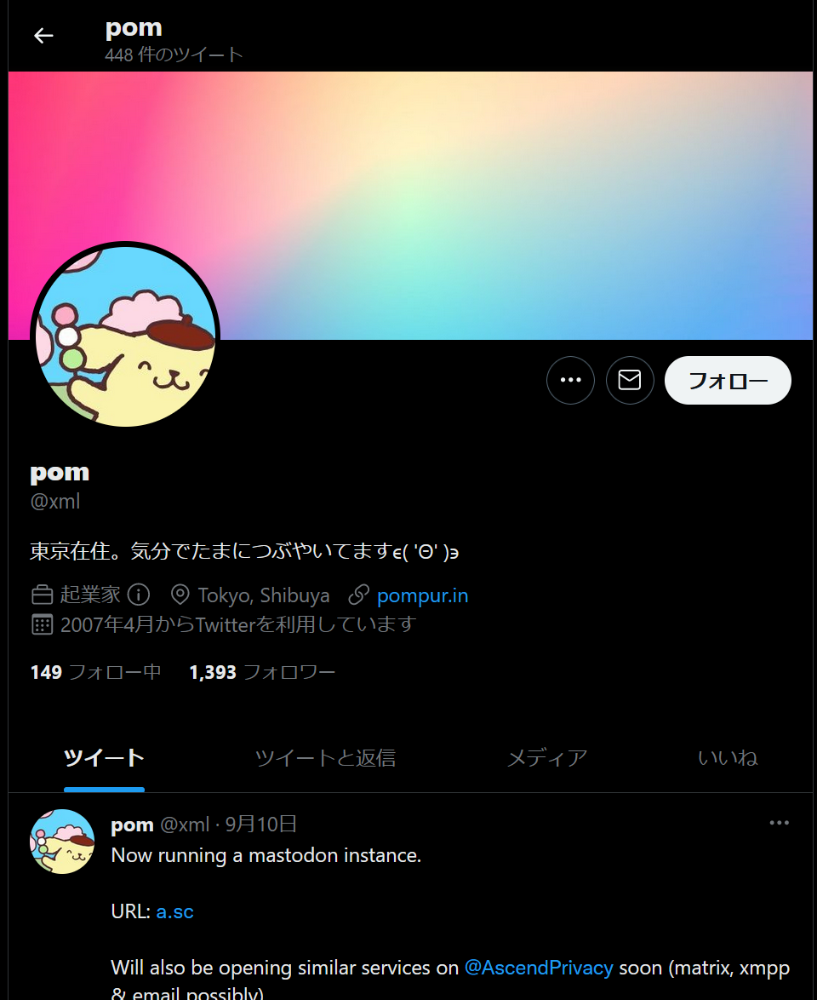

pompompurinは過去にFBIのメールをハッキング。企業の顧客情報のリークなどを行っている脅威アクターです。  
FBIのメールのハッキングした後から大きく知名度が高くなったのではないかと思っています。
RaidForum閉鎖後にBreachForumと呼ばれるハッキングフォーラムを運営しています。
個人的にこのpompompurinについて気になったので調べてみました。  

## 国籍について
彼のツイッターのプロフィール欄は日本語であり、東京在住とも記載されていますが、ツイートしている言語はほとんど英語です。

過去に日本語のツイートもチラホラありますが、2011年で更新が途絶えて2022年からずっと英語でツイートを行っています。
@xmlというアカウント名を得るためにハッキングを行ったのかもしれません。

SOCRadarという米国のサイバーセキュリティ企業のブログでpompompurinについての記事がありました。
> RaidForums was not the only forum he was a member of; he was also a member of Russian dark web forums such as XSS. Although we do not know 
> where he is from, we know that he speaks Russian. It is safe to assume he is from one of the Russian-speaking countries. 
> — <cite>SOCRadar[^1]</cite>
>  
> [訳]RaidForumsだけが彼のメンバーではなく、XSSのようなロシアのダークウェブフォーラムのメンバーでもあったのです。彼の出身地は不明ですが、
> ロシア語を話すことは分かっています。ロシア語圏のいずれかの国の出身と見て間違いないでしょう。 -Deep翻訳-
> 
[^1]: The above quote is [SOCRadar blog](https://socradar.io/dark-web-threat-profile-pompompurin/) July 21, 2022

XSS[.]isはロシアやウクライナ向けのハッキングフォーラムです。彼がロシア語でスレッドを立ててることから
ロシア圏の脅威アクターだと推測されています。

## Pomのアカウントとかいろいろ
[Twitter]   
        @xml                 (www.Twitter.com/@xml)   
        @pompompuri_in(凍結)  
        https://archive.ph/https://twitter.com/pompompur_in  
        https://web.archive.org/web/20210615000000/https://twitter.com/pompompur_in  
        @past(凍結)  
        @  
[Ÿ HŸPE]  
        https://yhype.me/github/@pompompurins  
### 多分pomの友達
- dedale
[Website] https://web.archive.org/web/20220720081436/https://baph.is/  
[PGP] https://web.archive.org/web/20220808165105/https://baph.is/pgp.txt  
- psauxx 

[関連記事]
https://ke-la.com/ja/six-months-into-breached-the-legacy-of-raidforums/

