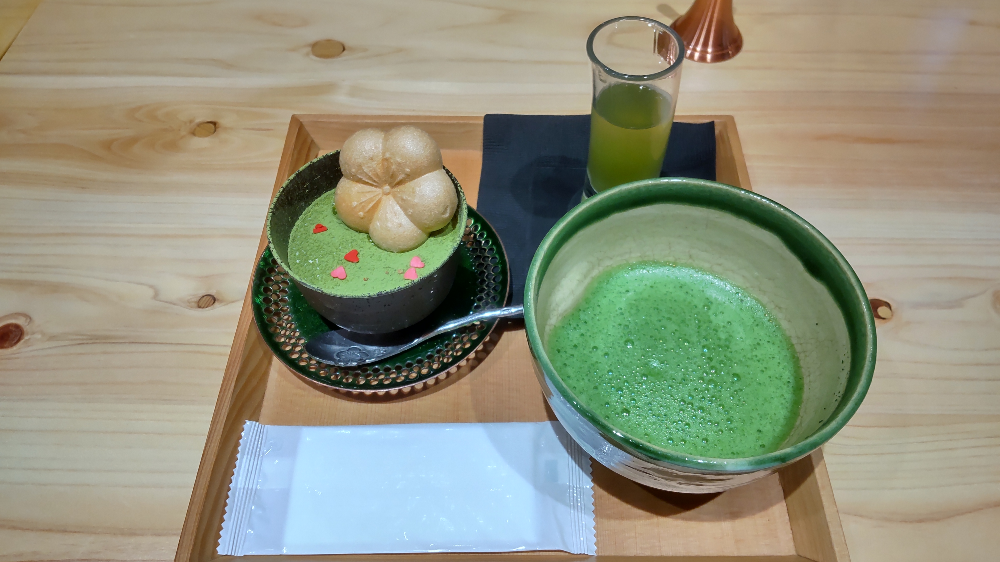
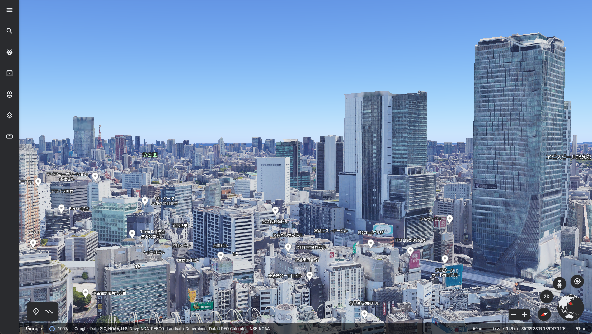

+++
title = "TsukuCTF22 Writup"
date = 2022-10-23T23:13:05+09:00
draft = false
categories = [
	"CTF",
	"Writeup"
]
image = "logo.png"
+++

## 結果
 

47位でした！正答率ひくすぎぃぃぃぃぃいいい

## Attack of Tsukushi
> つくしくんはある観光地を調査した際に訪れた駅で写真を撮影した。  
> 果たしてこの写真が撮られた駅はどこだろうか？ フラグは駅の郵便番号（ハイフンなし）を入力して下さい  
> e.g. 東京駅の場合は郵便番号が100-0005なのでフラグは TsukuCTF22{1000005} となります。 
> 

Googlレンズにぶっこむとそれっぽいリヴァイ兵長がでてきます。
  
  

## Money
> どこ？ フラグは写真が撮影された場所の郵便番号(ハイフンを除く)を入れて下さい。  
> 例えば撮影された場所が東京都庁の場合、郵便番号は163-8001なのでTsukuCTF22{1638001}となります。  
> 

リヴァイの問題と同じようにGoogleレンズに入れてみます。

出てきたブログを読むと、どうやら金閣寺にあるそうです。

## FlyMeToTheTsukushi
> つくし君は、はるばる飛行機で愛するパートナーのもとへやってきました。
> ここはどこの空港かわかりますか？
>
> この問題はフラグを10回までしか提出できません。
> ※フラグの形式はTsukuCTF22{空港名}です。空港の名前だけを入力してください。(hoge空港の場合、hogeのみがフラグになります)
> 

とりあえず、JALの「AIRBUS A350」という機体を探します。

対象経路から「羽田」「伊丹」「新千歳」「福岡」「那覇」まで絞りました。これを全部回答してみます。  

## inuyama082
> つくし君は愛知県犬山市にデートに来た時の思い出の写真を見返しています。 
> おいしそうな写真を見つけ、おやつが食べたくなりました。 写真のおやつの名前を教えてください。  
> ※フラグの形式はTsukuCTF22{XXXXXXX ver.XXXXXX}です。
> 

息を吸うようにGoogle画像検索にぶち込みます。誰かのブログが出てきます。  
「犬山よあけや」というお店にこのお菓子があるようです。  
なのでメニューにある通り「和チーズケーキ」を送信しまくります。
しかし名前は「ver」があるので違います。
もう一度検索に「ver」をつき足して再検索すると  
このツイートに行きつきます。
<blockquote class="twitter-tweet">
新登場❣️ 和チーズケーキ ver.ココアパウダー😋 和チーズケーキに ココアパウダーを トッピング✨ 和チーズケーキの 新たな味を ぜひご堪能ください🎶<a href="https://twitter.com/hashtag/%E7%8A%AC%E5%B1%B1%E5%9F%8E%E4%B8%8B%E7%94%BA?src=hash&amp;ref_src=twsrc%5Etfw">#犬山城下町</a> <a href="https://twitter.com/hashtag/%E7%8A%AC%E5%B1%B1%E3%82%B0%E3%83%AB%E3%83%A1?src=hash&amp;ref_src=twsrc%5Etfw">#犬山グルメ</a> <a href="https://twitter.com/hashtag/%E7%8A%AC%E5%B1%B1%E3%82%AB%E3%83%95%E3%82%A7?src=hash&amp;ref_src=twsrc%5Etfw">#犬山カフェ</a> <a href="https://twitter.com/hashtag/%E9%A3%9F%E3%81%B9%E6%AD%A9%E3%81%8D?src=hash&amp;ref_src=twsrc%5Etfw">#食べ歩き</a> <a href="https://t.co/N8uVz2eQTB">pic.twitter.com/N8uVz2eQTB</a>
&mdash; 犬山よあけや (@inuyamayoakeya) <a href="https://twitter.com/inuyamayoakeya/status/1520908426603163649?ref_src=twsrc%5Etfw">May 1, 2022</a></blockquote> 
「和チーズケーキ ver.ココアパウダ」を送信します。これも違います。
悩んでいると、与えられた画像は抹茶じゃんと思い、「和チーズケーキ ver.ココアパウダ　抹茶」で調べます。

ありました。

## sky
> 帰ってくるあなたが最高のプレゼント。つくし君は電車にガタゴト揺られています。
> 次の停車駅で降りるようなのですが、どこかわかりますか？
> ※フラグの形式はTsukuCTF22{次の停車駅}です。公式サイトの表記を採用します(スペースは含めません)。

とりあえず、画像から得られる情報を整理します  
・CentXという文字  
・Windという雑誌  
・ガラスに反射している赤い記号  
・Wi-Fiが利用できるマークがある  
最初は新幹線の中という線でシート席の色を調べていましたが見当たらず、やめました。  
「Wind雑誌　新幹線」で調べてみるとyahoo知恵袋で手がかりがつかめました。
どうやら新幹線ではなく「名鉄ミュースカイ」の中らしかったです。
そこで名鉄ミュースカイのシートについてのブログを読んで、最後の記事に「名鉄名古屋」という駅名標の画像があったので送信しました。  
確かこれがFlagでしたが、名鉄ミュースカイの停車駅は結構多かったのでまぐれだったなと思います...

## station
> つくし君はとある駅で友達を待っています。さて、つくし君はどこの駅にいるでしょうか？
> TsukuCTF22{駅名(漢字、平仮名、英語可)}
> 

画像から分かるのは
・壁の絵  
・緑のライン  
・東豊線  
・女性車両らしい  
・なんか右上に「1[]」って書いてある  
東豊線は北海道にある市営地下鉄らしいです。路線図を見ると「大通駅」がほかの南北線と東西線を結んでいるようです。  
そして壁に書いてあるのは「大通り駅」から見て「新さっぽろ駅」に向かうまでの路線だと考えました。  
また、札幌市営地下鉄の公式サイトには女性車両についてこのように記述されていました。これから東西線であろうと推定しました。

これらからFlag「大通り駅」ではないか。違いました。  
ではひとつ前に駅の「西11丁目」ですか？？ これでflagをとってしまったと思います。

## douro
> 旅行中のつくし君は迷子になってしまったようです。うつむいています。送られてきた写真から場所を特定できますか？  
> ※フラグの形式はTsukuCTF22{緯度 _ 経度}です。ただし、緯度経度は十進法で小数点以下五桁目を切り捨てたものとします。  
> 

この画像を拡大してみると、

自分には 「よいはもーる　1990」と読めました。これをそのまま調べると四五百商店街(よいほモール)がの公式サイトに画像と同じタイルが見つかります。  
散歩ブログ的なものを読んで、このタイルがどこにあるかを探します。

## Where
> 北海道に住んでいるつくしさんは東京旅行に行った際に高層ビルの窓から写真を撮りました。  
> でも撮影した場所を忘れてしまったようです。この写真が撮影された場所について建物名を教えてあげてください。  
> フラグはこの建物の開業日(YYYY/MM/DD)です。  
> たとえば、東京スカイツリーの開業日は2012年5月22日なので、フラグはTsukuCTF22{2012/05/22}となります。  
> 

とりあえず、google画像検索をしてみるとこの画像で一番高いビルは「渋谷スイカ」ということが分かりました。確かに画像を拡大してみても「SHIBUYA SKY」の文字が確認できます。
また、この画像からは左奥に東京タワーが見えます。この条件からの角度をGoogle Erthを使って調べると

見えるであろうビルを答えますが、このビルは5回改装工事をしており、そのため5回リニューアルオープンしています。この場合一番最初の開業日がflagだったみたいです。

## Gorgeous Interior Bus
> 観光地に来たつくし君は、豪華なバスを見かけたので、それに乗って観光することにしました。 
> その時、つくし君のお母さんから「どこにいるの？」と連絡が着ましたが、
> おっちょこちょいなつくし君は、観光地の名前も、乗っているバスの路線も忘れてしまい、
> とっさに車内の写真を撮って、「ここ」と返信しました。 つくしくんはどこにいるのでしょうか？
> つくしくんが写真を撮ったところに最も近い交差点の名前を特定してください。  
> ※フラグの形式はTsukuCTF22{交差点の名前}です。
> 

google画像検索によりバスは熱海を走る「湯～遊～バス」と分かります。  
湯～遊～バスの周回ルートを調べると熱海駅を出発から出発するらしいです。
湯～遊～バスが停車するバス停表を見ながら、画像の奥のパネルにある文字と見比べます。  
画像には「親水公園」「銀座」と書いてあり、次のバス停は「銀座」だと推測できます。
Googleストリートビューでバス停銀座から湯～遊～バスのルートを逆走します。
するとこの看板がある交差点があります。
 

 
この問題めっちゃ旅行行きたくなりました。。。

## Bringer_of_happpiness
> つくしくんは荷物を運び終えて休憩してるときに撮った写真。さて撮影場所はどこだろう？
> ※フラグの形式はTsukuCTF22{緯度 _ 経度}です。ただし、緯度経度は十進法で小数点以下五桁目を切り捨てたものとします。
> 

画像から分かることは
・黄色い電車  
・j- なんとかかんとか　というスーパーマーケット？？  
・パチンコ店ののぼり  
・踏切  
・駅名が書かれてるところに、変な眉毛みたいなのが書かれてある  
 
これではわかりそうにないので黄色い電車の特徴をもっと詳しく見ていきます。  
・後ろの窓が３つ  
・なんか丸いのが付いてる  
・左になんか書いてある？  
 
これらから「黄色い電車」で調べた画像を見ていきます。すると島原鉄道がそれっぽいなと思いました。  
公式サイトから黄色い電車が停まる各駅がどんな風景なのかを見ていくと、終点に眉毛みたいな駅名標の画像がありました。(眉毛はスポットライトだったみたい)  

## Desk
> つくし君の大好きなお姉さんのデスクを見学させてもらったよ。 さて、このデスクはどこにあるのだろうか?  
> フラグ形式は写真が撮影された場所の郵便番号(ハイフンを除く)を入れて下さい。
> 例えば撮影された場所が東京都庁の場合、郵便番号は163-8001なので TsukuCTF22{1638001} となります。
> 

これはテレパシー使ってますが、クリアファイルの画像を見て、沖縄かな？と思ってしまいました。
沖縄の地図と一致しているため沖縄であることまでは確定しました。  
画像で気になったのは  
・右下にキャラクター  
・なんか緑いっぱいい  
・○○のデスク　ハートのロゴ？  
・奥に島みたいなのがある  

ハートにモザイクがかからなかったのが気になり、「沖縄　ハート　ロゴ」で調べました。するとこれは南城市のロゴだと分かります。  
また、キャラクターは南城市のマスコットキャラクターである「なんじぃ」だと分かりました。
また、島に関しても南城市の目に前には久高島という島があります。しかしこれは西原町という線も捨てきれないなと思いました。

南城市のブログを読んでいて、こんなデスクがあるのはどんな人かを考えたときに観光課だろうと思いつきました。  
Google Mapで南城市の観光課を調べてみていくとありました。

## TakaiTakai
> 日本の町は美しい。撮影地を答えてください。フラグはこの建物の開業日(YYYY/MM/DD)です。  
> たとえば、東京スカイツリーの開業日は2012年5月22日なので、フラグはTsukuCTF22{2012/05/22}となります。
> 

画像を眺めていて何もひらめきませんでしたが、多分東京なんだろうな～と思いながら、手前に見えるビルの青いロゴに注目して調べていきました。

「青いロゴ　会社　日本」で調べて画像を見ていくと、「日本システムウエア株式会社」がそれっぽいなと思いました。
Google Erthでこのビルを確認しにいきます。

ありました。日本システムウエア株式会社のビルを見ることができる建物がフラグです。

## uTSUKUSHIi

> 私は世界一可愛い猫ちゃんの写真を見つけました。この猫ちゃんの生年月日を答えてください。  
> フラグフォーマットは TsukuCTF22{YYYY/MM/DD} です。  
> 

もう、最初見たときは情報量少なすぎて意味わかりませんでしたが、情報を整理することでなんとなく見えてきました。  
・ねこじゃらし  
・黄色いソファ  
・かご  
・灰色と白の猫  
 
フラグの形式とねこじゃらしから画像は猫カフェではないかと推測しました。  
とりあえず、猫の種類を調べようとGoogle画像検索で調べます。すると
「ブリティッシュショートヘア」だと分かりました。ブリティッシュショートヘア(グレー＆ホワイト)がいる猫カフェを見つけようとしましたがしかし見つかりませんでした。  
方向を変えて「猫カフェ　黄色いソファ」で検索しました。すると本当に雰囲気がよさそうな黄色いソファのある猫カフェが京都・河原町に新店舗オープンするという記事を見つけました。

公式サイトから画像と同じような柄をした猫を見を見つけられました。

## 感想
常設CTFやOSINT問題のWritupを読んでみたりはしたことありましたが、まともに出たCTFは初めてになります。なのでWritupを書くのも初めてです。今回はガチで挑みました。
実力としては正答率が気になりました。実際のOSINTで出題者の意図をかんがえて...なんてことはありませんし、ここまでの間違えだと推測したものが違ってしまうと一生回答にたどり着かないなと思いました。  

 
なにか著作権的にまずいものがあれば知らせてください。早急に削除します。
